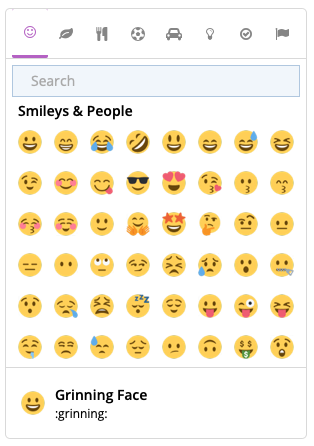

= Twemoji Selector for WSC

Twemoji selector for WoltLab Suite Core (3.0+) is a developer extension. Developers can simple add this extension to there extension and trigger the selector.

Images are copyright by Missive.

== Content
This package contains a Twemoji selector and a simple Twemoji parser. The parser converts native emojis to Twemojis.

== Implementation
It is very easy to implement this extension. First add the following `requiredpackage` line to your `package.xml`.

.package.xml
[source,xml]
----
<requiredpackage minversion="1.0.0">dev.hanashi.wsc.twemoji-selector</requiredpackage>
----

=== Twemoji Selector

Implement the following JavaScript code into your template or JavaScript file:
[source,javascript]
----
require(["Hanashi/Twemoji/Selector"], function(TwemojiSelector) {
    var options = {
        callback: function(emoji) {
            console.log(emoji);
        }
    };
    new TwemojiSelector(options);
});
----

Now add following in your template file:
[source,html]
----
<twemoji-selector></twemoji-selector>
----
This is the default selector, where the Twemoji selector should be displayed. You can change this with the option `selector`.

You have the following options:

.Selector Options
|===
|Option name|Type|Required|Default|Description

|callback
|function
|true
|`null`
|Specify a callback function, that is triggered, if a user clicks on a emoji. You receive an emoji object as parameter.

|selector
|string
|false
|`twemoji-selector`
|This is the css selector where the Twemoji selector box should be displayed.

|dataPath
|string
|false
|`WCF_PATH + 'js/Hanashi/Twemoji/twemoji.json'`
|The data path to the Twemoji json data file.

|theme
|string
|false
|`auto`
|You can select a theme for the selector.

`auto`: the Twemoji selector has theme dark or light, depence on system setting of the user.

`light`: a simple light theme

`dark`: a simple dark theme
|===

=== Twemoji Parser
The Twemoji parser is searching in a selector for native emojis and replace that with a Twemoji.

Implement the following JavaScript Code into your template or JavaScript file:
[source,javascript]
----
require(["Hanashi/Twemoji/Parser"], function(TwemojiParser) {
    var options = {
        selector: '#myDiv'
    };
    new TwemojiParser(options);
});
----

You have the following options:

.Parser Options
|===
|Option name|Type|Required|Default|Description

|selector
|string
|true
|`null`
|This option defines the selector, where emojis should be converted. Don't use elements, where JavaScripts events are defined.

|dataPath
|string
|false
|`WCF_PATH + 'js/Hanashi/Twemoji/twemoji.json'`
|The data path to the Twemoji json data file.

|size
|integer
|false
|`24`
|This specify the size of the generated images. Allowed sizes are: `18`, `22`, `24`, `34` and `66`.
|===
